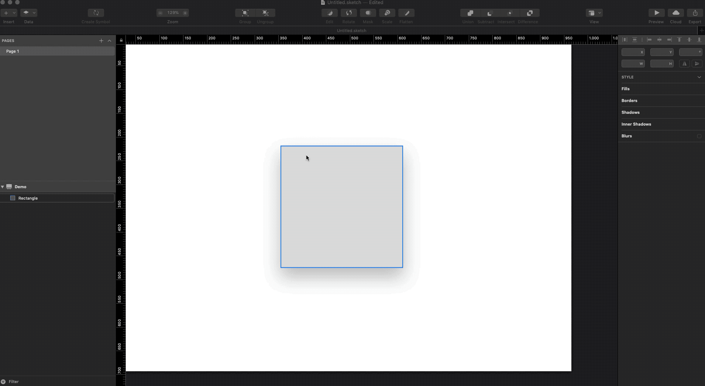
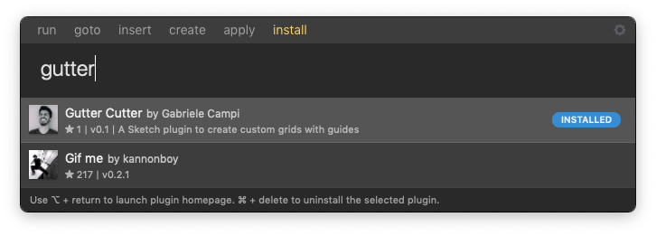

# Gutter Cutter
A Sketch plugin to create custom grids with guides

## Install with Sketch Runner
With Sketch Runner, just go to the `install` command and search for `Gutter Cutter`. Runner allows you to manage plugins and do much more to speed up your workflow in Sketch. [Download Runner here](http://www.sketchrunner.com).

